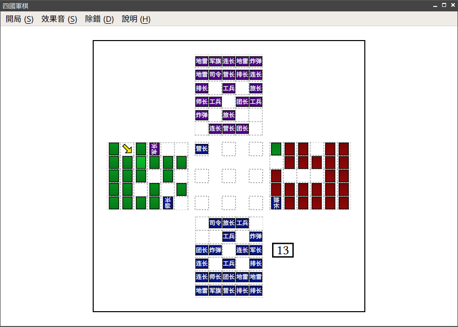

# 單機版四國軍棋

## 簡介

此專案為 [四國軍棋](https://zh.wikipedia.org/wiki/%E9%99%B8%E8%BB%8D%E6%A3%8B) 的一個實作，使用 Qt5/C++11/HTML5 寫成，以 LGPL 授權條款發佈。



當前本程式支援的 AI 只有兩種：「無腦 AI」和「低智商 AI」。前一種非常無腦；後一種稍有一點頭腦，但主要是隨機落子。

## 編譯及安裝

編譯方式同一般的 Qt 程式一樣：

```
$ qmake
$ make
```

Archlinux 使用者可以直接通過 AUR 安裝：

```
$ yaourt -S gwankei-git
```

## 注意

本程式相依於 `qtwebkit`. 由於 `qtwebkit` 在 Qt5 中仍為實驗性功能（且無官方支援），本程式在 Windows 平台上無法正常運作 (Segfault), 但在 GNU/Linux 上沒有類似問題。